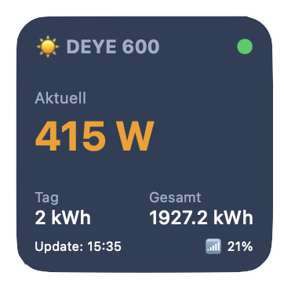

*Deutschsprachiges ReadMe: [Deutsch](README_DE.md).*

---

# ☀️ Deye Solar Inverter Apple Widget (iOS/iPadOS/macOS)

<p align="center">
  
</p>

With this Scriptable script, you can display the live power output and yield data of your Deye inverter (e.g., Deye SUN600G3-EU-230 or compatible balcony solar power plant inverters like the BOSSWERK 600) directly as a native, compact widget on your Apple desktop (macOS) or home screen (iOS/iPadOS).

The widget runs in the **Small format** (square) and features smart caching: If the inverter goes offline at night or during poor weather, the widget won't crash. Instead, it elegantly displays the last known daily and total yields from a local file, while the current power output is set to `0 W`.

---

## 📦 Requirements (Deye)

| Component | Details |
| :--- | :--- |
| **Inverter** | A Deye inverter with an integrated Wi-Fi logger (accessible via a local IP address within the same network). |
| **Credentials** | Username and password for the inverter's web interface (default is often `admin` / `admin`). |
| **Apple Device** | An iPhone, iPad, or Mac on the same Wi-Fi network as the inverter. |
| **App** | The free **Scriptable** app from the App Store. |

---

## 🛠 Step-by-Step Setup (Deye)

1. **Find the IP address:** Make sure your Deye inverter is turned on. Find its local IP address in your router (e.g., `192.168.178.50`). Type this IP into a web browser to check if you can reach the inverter's status page.
2. **Prepare Scriptable:** Open the **Scriptable** app on your Apple device and create a new, empty script using the **+** icon in the top right corner. Name it, for example, `Deye-Inverter`.
3. **Insert code:** Copy the complete JavaScript code from the `widget-deye-inverter.js` file here on GitHub and paste it into the empty script in the app.
4. **Adjust configuration:** At the very top of the code in the `1. BENUTZER-EINSTELLUNGEN` (User Settings) block, enter your details:
```javascript
   const DEYE_IP = "192.168.XXX.XXX"; // Your inverter's IP
   const USER = "YOUR_USERNAME";      // Your web login (mostly admin)
   const PASS = "YOUR_PASSWORD";      // Your web password
```
### 📲 Place the Widget

Go to your home screen or desktop, add a new **Scriptable widget**, make absolutely sure to select the **Small** size, press and hold the widget, select **"Edit Widget"**, and assign the script you just created.

---

## 🛡️ Security & Privacy (Deye)

Since this script runs locally on your Apple device and your credentials are hardcoded in the source code, the following security aspects apply:

* **Local encryption by Apple:** Your credentials reside exclusively in the local storage of your iPhone, iPad, or Mac. Thanks to the iOS sandbox system, the script contents are protected from access by other apps and are transmitted encrypted within your iCloud backups.
* **No cloud requirement:** The data is queried directly from the inverter over your local network via HTTP Basic Authentication. No data is transmitted to external servers or third parties.
* **Remote access ONLY via VPN:** If you want to see live data while away from home (outside your home Wi-Fi), **never** set up port forwarding in your router! This would be a massive security risk since the connection is unencrypted (HTTP). Instead, use a secure VPN connection (e.g., WireGuard or your router's built-in VPN like Fritz!Box) to securely dial into your home network from outside. Only this way can the widget reach the inverter securely while on the go.

---

## ❓ FAQ & Troubleshooting (Deye)

### The widget only shows gray text / "(Cache)" – what is the cause?

If the values in the widget are colored gray and the word `(Cache)` appears in the footer, it means that the script cannot fetch live data from the inverter and is freezing the old data for safety. 
There are three possible causes for this:

1. **It is nighttime or cloudy:** Deye inverters are powered directly by the solar panels. As soon as the sun stops shining, the inverter's internal Wi-Fi logger shuts down completely. This is absolutely normal! The widget saves your data, sets the current power output to `0 W`, and automatically switches back to **Green (🟢)** and live mode the next morning when the sun comes up.
2. **Wrong Wi-Fi network:** Since the inverter is queried via its local IP address, live polling only works if your iPhone/Mac is on the **same home Wi-Fi**. If you are away on a cellular network (LTE/5G) without being connected to your home VPN, or if you are in a separate guest Wi-Fi, the script cannot reach the inverter and switches to cache mode.
3. **Incorrect credentials or IP:** Check the variables `DEYE_IP`, `USER`, and `PASS` at the very top of the script. If the inverter's IP address has changed via the router or the password is wrong, the login will fail.
   * *Solution tip:* Assign a **"static IP address"** to the inverter in your router settings.

### How do I customize the name in the widget?

At the very top of the code you will find the variable:

```javascript
const WIDGET_TITLE = "☀️ DEYE 600";
